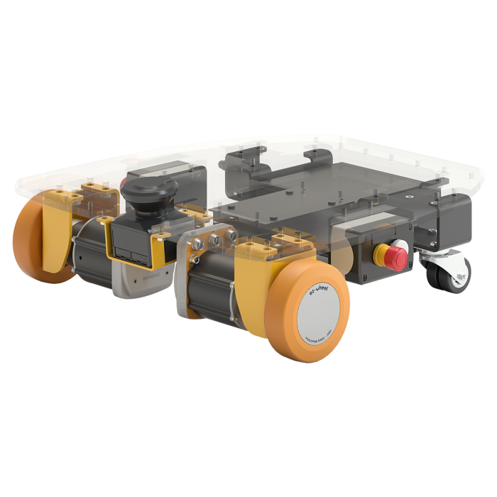
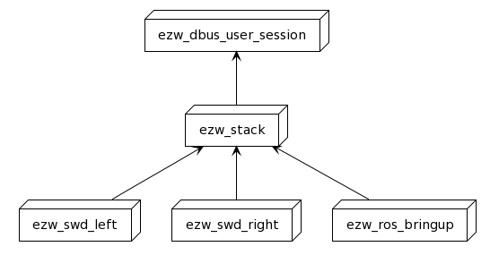

# Getting started

The [SWD® StarterKit](https://www.ez-wheel.com/en/development-kit-for-agv-and-amr) comes with a simple ROS configuration, which is launched
automatically at startup. A brief technical description is available [here](https://www.ez-wheel.com/en/development-kit-for-agv-and-amr), under "Main Specifications", and "Downalod".

All you need is to:

- Turn on [SWD® StarterKit](https://www.ez-wheel.com/en/development-kit-for-agv-and-amr)
- Use the joystick to control the robot.
- Connect to the WiFi hotspot (named `SWD®-Starter-Kit-XXXXXX`)
- Open URL <http://10.10.0.1> to access the web interface.

The default ROS configuration uses the `hector_mapping` package to build a map of the environment. An alternative mapping process based on `iris_lama` is also available.

It also comes with a [web interface](http://10.10.0.1), to visualize the map and pose of the kit, and the safety functions.

# SWD® StarterKit architecture

## Linux architecture

The SWD® StarterKit comes with a preinstalled Linux, and the Robot Operation System (ROS) Middleware. It is configured as a plug-and-play mobile platform. ROS nodes are started automatically at launch time, thanks to Linux services.

The SWD® StarterKit requires services to manage the D-Bus session and abstract the CANOpen communication. Services are managed using `Systemd`, and uses D-Bus to communicates with each other.

### The `ezw-dbus-user-session` service

This service launches a D-Bus user session, and stores the information in `/tmp/SYSTEMCTL_dbus.id` file. Other services can load this file and get the session parameters. So that, they can communicate with each other over D-Bus.

### The `ezw-stack` service

This service runs with root permissions. So, it can mount and setup the CAN bus interface (`can0`). It is also used as a synchronization point for the services depending on it.

### The `ezw-swd-left` and `ezw-swd-right` services

These services launches ez-Wheel SWD® Service for the left and right SWD® motors.

### The `ezw-ros-bringup` service

It is the entry point for the ROS world. This service starts `starter_kit.launch` from the package `swd_starter_kit_bringup`. Note that, `starter_kit.launch` also launches `swd_ros_controllers` that requires an access to the D-Bus session created by `ezw-dbus-user-session` service. If it is launched from Systemd, the service automatically sets-up the relevant D-Bus session
parameters from `/tmp/SYSTEMCTL_dbus.id` file.

## ROS architecture

The SWD StarterKit comes with a default ROS configuration, the ROS graph of nodes running by default is illustrated in the following figure.

The package [swd_starter_kit_bringup](https://github.com/ezWheelSAS/swd_starter_kit_bringup) is the entry point for the SWD® StarterKit. At startup, `swd_starter_kit_bringup/starter_kit.launch` is started, and provides an example of configuration for the SWD® StarterKit.

This launchfile starts the following ROS nodes:

- `swd_ros_controllers/swd_diff_drive_controller`: The differential drive controller for the two SWD® wheels. It takes a target velocity as input and provides the odometry, the associated TFs, and the safety functions status as output.
- `swd_robot_manager/robot_manager.py`: The robot manager is used to centralize the management of the kit in a single node.
- `joy/joy_node`: The joystick driver.
- `teleop_twist_joy/teleop_node`: The joystick to twist conversion node. It reads the inputs from the joystick message and convert them as a Twist message (linear and angular velocities).
- `urg_node/urg_node`: The IDEC SE2L LiDAR driver.
- `rosbridge_server/rosbridge_websocket`: Patched version of the websocket bridge, used to redirect ROS messages to the web interface.
- `tf2_web_republisher/tf2_web_republisher`: Republish TFs to the web interface.
- `tf/static_transform_publisher`: Publishes the static transforms of the robot.
- `hector_mapping/hector_mapping`: The HectorSLAM mapping. It uses odometry and LiDAR information to map the environment.

The SWD® StarterKit requires [swd_ros_controllers](https://github.com/ezWheelSAS/swd_ros_controllers) package to control both SWD motors. This package includes an implementation of a differential drive for two SWD® motors. Further informations are available on [github.com/ezWheelSAS/swd_ros_controllers](https://github.com/ezWheelSAS/swd_ros_controllers).

## System commissioning
### SWD® Core motors
The SWD® StarterKit cames with preconfigured pair of SWD® motors. However, you can change the configuration using commissioning scripts available on [swd-starter-kit-config](https://github.com/ezWheelSAS/swd-starter-kit-config) repository.

### The safety LiDAR
The LiDAR cames preconfigured with two security zones, one for the Safety Limited Speed (SLS), and the other for the forward Safe Direction Indication (SDI+). The configuration file is included also on the [swd-starter-kit-config](https://github.com/ezWheelSAS/swd-starter-kit-config) repository. If you need to change zones, make sure the LiDAR OSSDs are correctly configured (see [swd-starter-kit-config](https://github.com/ezWheelSAS/swd-starter-kit-config) for more information).
