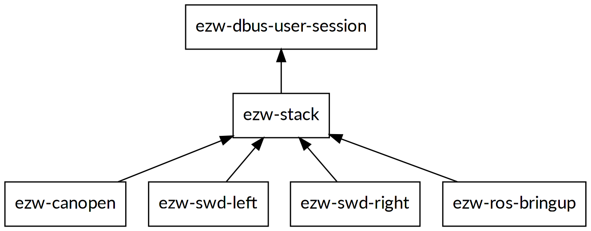
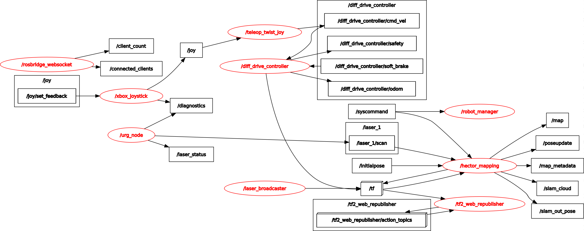

# Getting started

The [SWD® Starter Kit](https://www.ez-wheel.com/en/development-kit-for-agv-and-amr) comes with a sample ROS configuration, which is launched
automatically at startup. A brief [technical description is available here](https://www.ez-wheel.com/storage/upload/pdf/leaflet-starter-kit-swd-20092021-0.pdf).

All you need is:

-   Turn on the SWD® Starter Kit.
-   Use the joystick to control the robot.
-   Connect to the WiFi hotspot (named `SWD-Starter-Kit-XXXXXX`)
-   Open the <http://10.10.0.1> to access the web interface.

The default ROS configuration uses the `hector_mapping` package to build a map of
the environment. An alternative mapping process based on `iris_lama` is also available.

The SWD® Starter Kit comes with a web interface, which permits to visualize the
map and the pose of the robot, and the safety functions.

# SWD Starter Kit system architecture

## Linux architecture

The SWD® Starter Kit comes preinstalled with an Ubuntu 20.04 linux image, with
ROS Noetic.

The robot is configured as a plug-and-play, all needed ROS nodes for mapping are
launched automatically at startup.

The robot requires a set of services that manages the D-Bus session, the CANOpen
implementation, and the SWD® communications. The services are managed using
Systemd, and uses D-Bus to communicates with each other.

### The `ezw-dbus-user-session` service

This service launches a D-Bus user session, and stores the session information
in the file `/opt/ezw/data/tmp/SYSTEMCTL_dbus.id`. The other services load this
file to get the session parameters, and uses it to access and communicates over
D-Bus.

### The `ezw-stack` service

This service runs with root permissions to be able to mount and setup the
CAN bus interface (`can0`). It is also used as a synchronization point for the
services depending on it.

### The `ezw-canopen` service

This service launches the ez-Wheel CANOpen Service, which implements the CANOpen
protocol and plays the role of a CANOpen Master node.

### The `ezw-swd-left` and `ezw-swd-right` services

These services launches the ez-Wheel SWD Service for the left and right motors
respectively.

### The `ezw-ros-bringup` service

This is the entry point to the ROS world, this service launches the
`starter_kit.launch` from the package `swd_starter_kit_bringup`. Note that the
`starter_kit.launch` launches the `swd_ros_controllers` which requires an access to
the D-Bus session created by the `ezw-dbus-user-session` service. If it is
launched from Systemd, the service automatically sets up the right D-Bus session
parameters from `/opt/ezw/data/tmp/SYSTEMCTL_dbus.id`.

## ROS architecture

The SWD Starter Kit comes with a default ROS configuration, the ROS graph of
nodes running by default is illustrated in the following figure.

The package [`swd_starter_kit_bringup`](https://github.com/ezWheelSAS/swd_starter_kit_bringup) is the entry point, at the startup, the
`swd_starter_kit_bringup/starter_kit.launch` is launched, which provides an
example configuration of the SWD Starter Kit with other ROS ecosystem packages.

It launches the following ros nodes:

-   `swd_ros_controllers/swd_diff_drive_controller`: The differential drive
    controller for the two SWD wheels. It takes the target velocities as input and
    control the wheels according to that. It provides also the odometry, the
    associated TFs, and the safety functions.
-   `swd_robot_manager/robot_manager.py`: The robot manager, it is used to
    centralize the management of the robot in a single node.
-   `joy/joy_node`: The joystick driver.
-   `teleop_twist_joy/teleop_node`: The joystick to twist conversion node, it reads
    the inputs from the joystick message and convert them to twist (linear and
    angular velocities).
-   `urg_node/urg_node`: The IDEC SE2L LiDAR driver.
-   `rosbridge_server/rosbridge_websocket`: Patched version of the websocket bridge,
    used to redirect ROS messages to the web interface.
-   `tf2_web_republisher/tf2_web_republisher`: Republish TFs to the web interface.
-   `tf/static_transform_publisher`: Publishes the static transforms of the robot.
-   `hector_mapping/hector_mapping`: The HectorSLAM mapping, it uses the odometry
    and the LiDAR point cloud to construct a map of the environment.

The SWD® Starter Kit requires the [`swd_ros_controllers`](https://github.com/ezWheelSAS/swd_ros_controllers) package to control the two
SWD motors. This package includes an implementation of a differential drive
robot using two SWD® Core (or SWD® 150). More information on
[`github.com/ezWheelSAS/swd_ros_controllers`](https://github.com/ezWheelSAS/swd_ros_controllers)

## System commissioning
### SWD® Core motors
The SWD® Starter Kit cames with preconfigured pair of SWD® Core safety motors. However, you can change the motors configuration using the commissioning scripts available on the [swd_starter_kit_scripts](https://github.com/ezWheelSAS/swd_starter_kit_scripts) repository.

### The safety LiDAR
The LiDAR cames preconfigured with two security zones, one for the Safety Limited Speed (SLS), and the other for the forward Safe Direction Indication (SDI+). The configuration file is included also on the [swd_starter_kit_scripts](https://github.com/ezWheelSAS/swd_starter_kit_scripts) repository. If you need to change zones, make sure the LiDAR OSSDs are correctly configured (see [swd_starter_kit_scripts](https://github.com/ezWheelSAS/swd_starter_kit_scripts) for more information).
